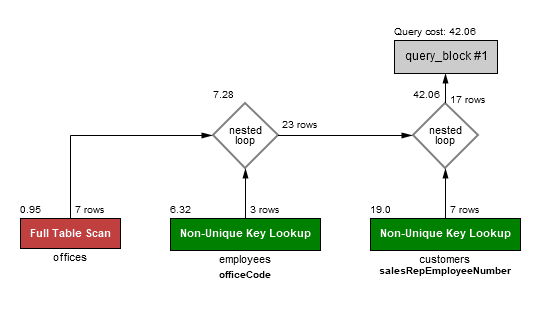
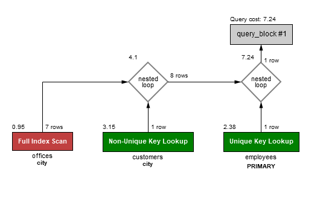
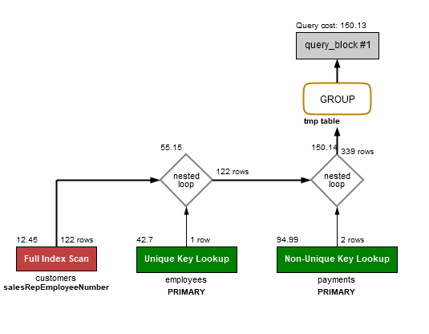
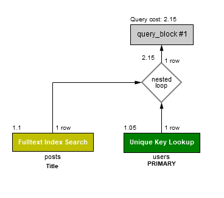

# Exercise 1
Query for selecting those customers who are in the same city as the office of their sales representative:
```sql
SELECT customers.customerNumber, customers.customerName, customers.city, concat(employees.firstName, employees.lastName) as salesRepresentative FROM customers INNER JOIN employees on customers.salesRepEmployeeNumber=employees.EmployeeNumber INNER JOIN offices ON employees.officeCode=offices.officeCode WHERE customers.city=offices.city;
```
A visualisation of the execution plan of the query:



# Exercise 2
Query for adding indexes to the following tables for better performance:
```sql
ALTER TABLE customers ADD INDEX `salesRepEmployeeNumber` (`salesRepEmployeeNumber`);
ALTER TABLE customers ADD INDEX `city` (`city`);
ALTER TABLE offices ADD INDEX `city` (`city`);
```
A visualisation of the execution plan of the query:


It is clear that the query cost has decreased from 42 to 7 after adding the indexes.


# Exercise 3
Query for knowing how much each office has sold and the max single payment for each office using GROUP BY:
```sql
SELECT employees.officeCode, SUM(payments.amount) as totalAmount, MAX(payments.amount) as maxSinglePayment FROM payments INNER JOIN customers ON payments.customerNumber=customers.customerNumber INNER JOIN employees ON customers.salesRepEmployeeNumber=employees.employeeNumber GROUP BY employees.officeCode;
```
A visualisation of the execution plan of the query:


Using Window function:
```sql
SELECT employees.officeCode, SUM(payments.amount) OVER (PARTITION BY employees.officeCode) as totalAmount, MAX(payments.amount) OVER (PARTITION BY employees.officeCode) as maxSinglePayment FROM payments INNER JOIN customers ON payments.customerNumber=customers.customerNumber INNER JOIN employees ON customers.salesRepEmployeeNumber=employees.employeeNumber;
```
A visualisation of the execution plan of the query:


It is clear that the query with Window function has a poor performance. The query cost with GROUP BY is 150 and with Window function is 491.


# Exercise 4
_This exercise uses the database from https://github.com/ulhaq/sql-stackoverflow_
Query for getting the titles of all posts which contain the word _grep_ in the Title and the posts owners' DisplayName.
```sql
SELECT posts.Title, users.DisplayName FROM posts LEFT JOIN users ON posts.OwnerUserId=users.Id WHERE posts.Title LIKE "%grep%";
```


# Exercise 5
Query for adding a FULLTEXT index to posts:
```sql
ALTER TABLE posts ADD FULLTEXT `Title` (`Title`);
```

The amended query from exercise 4:
```sql
SELECT posts.Title, users.DisplayName FROM posts LEFT JOIN users ON posts.OwnerUserId=users.Id WHERE MATCH(Title) AGAINST('grep' IN NATURAL LANGUAGE MODE);
```
A visualisation of the execution plan of the query:
